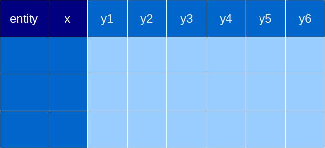

## 1. 存储结构

* 标的(entity)

* 索引(x)

* 属性(yn)

### 组合

* 单标的(entity) & 单属性(y)
* 单标的(entity) & 多属性(y)
* 多标的(entity) & 单属性(y)
* 多标的(entity) & 多属性(y)

## 1. 比较(compare)

### 语义

> entity1(x,y) vs entity2(x,y)

### 图表(chart)

#### 曲线图(line)
适用:x值(一般为timestmap)较多

* 某个entity某属性的变化趋势
* 某个entity多属性的比较
* 多个entity某属性的比较

#### 柱状图(bar)
适用:x值(一般为timestmap)较少

* 某个entity多个属性的比较
* 多个entity某个属性的比较

### 直方图(Histogram)
使用:连续的数据分布

* 某个entity某个属性按范围的分布

## 2. 构成(composition)

### 语义

> entity(y1,y2,y3...)

### 图表(chart)

#### 面积图(area chart)
适用:单个entity,x较多

* 某个entity多属性构成的变化趋势
* 某个entity多属性的比较

#### 饼图(pie chart)
适用:单个entity,单个x

* 某个entity多个属性的比较